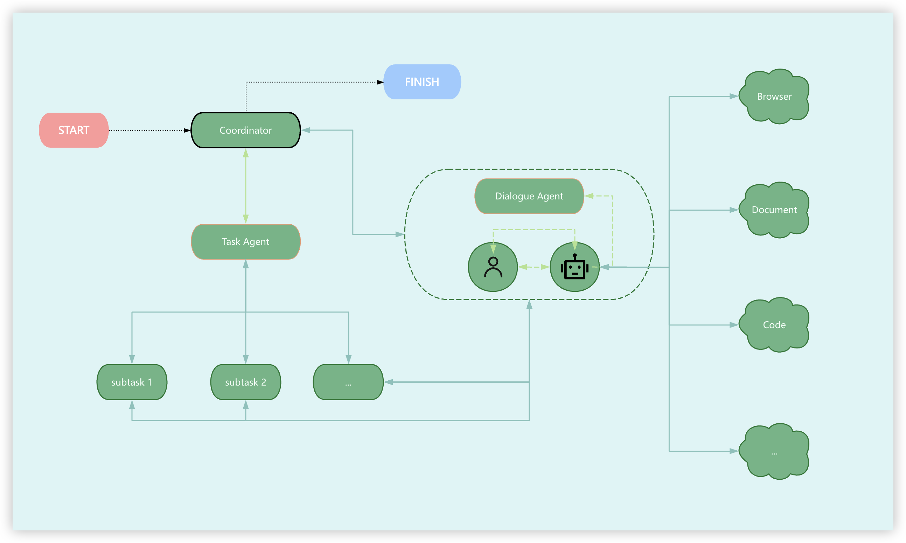

# LuguManus

[English](./README.en.md)
[繁體中文](./README.zh-TW.md)
[简体中文](../README.md)
[日本語](./README.ja.md)

LuguManus 是一個使用 Electron 和 TypeScript 構建的智能化桌面應用框架，深度整合了先進的大型語言模型與實用工具組件，創造出一個強大的自動化和輔助系統。


## 主要特點

- **多代理協作機制**：採用基礎代理、對話代理和任務導向代理三層架構，通過協同工作模式解決複雜問題
- **智能任務分解**：能夠自動將複雜任務拆解為多個可執行的子任務，並按順序或依賴關係執行
- **工具鏈集成**：內置網頁搜索、文檔處理、圖表生成和代碼執行等多種工具組件
- **響應式數據流**：基於 RxJS 構建的響應式架構，提供流暢的異步消息處理能力
- **瀏覽器模擬交互**：通過 Electron 實現的瀏覽器行為模擬，可執行網頁瀏覽、內容提取、執行網頁行為等操作
- **多模型支持**：支持不同類型的 AI 模型（文本、長文本、代碼、圖像識別等）

## 技術棧

- Electron 桌面應用框架 
- TypeScript 類型安全
- Prisma ORM + SQLite 數據持久化
- RxJS 響應式編程
- OpenAI SDK 模型集成(Qwen)

## 應用場景

LuguManus 適用於需要 AI 輔助的各類桌面應用場景，包括但不限於：

- 智能文檔處理與分析
- 自動化網絡信息檢索與整合
- 複雜任務規劃與執行
- 代碼輔助與運行
- ...

我們正在不斷完善這個框架，歡迎開發者參與貢獻，共同打造更強大的 AI 桌面工具生態。

## 目錄

- [快速開始](#快速開始)
- [項目結構](#項目結構)
- [架構設計](#架構設計)
- [安裝設置](#安裝設置)
- [貢獻指南](#貢獻指南)
- [許可證](#許可證)
- [致謝](#致謝)
- [聯繫我](#聯繫我)

## 快速開始

1. 安裝依賴

```bash
# 克隆項目
git clone https://github.com/electron-manus/lugumanus.git
cd lugumanus

# 安裝依賴
bun install

# 構建 packages
bun run build-deps

# 運行渲染進程
bun nx run @lugu-manus/renderer:dev

# 運行主進程
bun nx run @lugu-manus/main:dev
```

## 項目結構

```bash
lugumanus/
├── apps/                       # 應用程序目錄
│   ├── main/                   # Electron 主進程
│   │   ├── src/                # 主進程源代碼
│   │   │   ├── agent/          # 代理系統 (基礎代理、對話代理、任務代理)
│   │   │   ├── model/          # 模型集成 (聊天完成等)
│   │   │   ├── toolkits/       # 工具套件集合
│   │   │   │   ├── search-toolkit/      # 搜索工具集成
│   │   │   │   ├── chart-toolkit/       # 圖表生成工具
│   │   │   │   ├── document-toolkit/    # 文檔處理工具 (Markdown、Excel、PPT)
│   │   │   │   └── code-toolkit/        # 代碼執行工具
│   │   │   ├── routers/        # tRPC API 路由
│   │   │   ├── studio-preload/ # Studio 預加載腳本
│   │   │   ├── window.ts       # 窗口管理
│   │   │   ├── main.ts         # 主進程入口
│   │   │   └── preload.ts      # 預加載腳本
│   │   ├── prisma/             # Prisma ORM 相關
│   │   │   └── schema.prisma   # 數據庫模型定義
│   │   └── scripts/            # 構建腳本
│   └── renderer/               # 渲染進程 (前端UI)
│       └── src/
│           └── components/     # React 組件
│               └── studio/     # Studio 相關組件
│
├── packages/                   # 可復用模塊包
│   ├── electron-browseruse/    # 瀏覽器自動化工具
│   │   ├── src/                # 瀏覽器工具源代碼
│   │   └── README.md           # 瀏覽器工具說明文檔
│   ├── shrink-dom/             # DOM 處理工具
│   │   └── src/                # DOM 處理源代碼
│   └── share/                  # 共享工具和組件
│
├── package.json                # 項目依賴和腳本
├── nx.json                     # Nx 配置
├── commitlint.config.js        # 提交規範配置
├── .gitignore                  # Git 忽略配置
└── README.md                   # 項目說明文檔
```

### 核心目錄說明

- **apps/main**: 包含 Electron 主進程代碼和後端邏輯
  - 代理系統 (`agent/`): 實現多代理協同工作機制
  - 工具集 (`toolkits/`): 各種功能工具實現
  - 數據庫 (`prisma/`): 使用 Prisma ORM 與 SQLite 管理數據

- **apps/renderer**: 包含前端界面代碼，基於 React 實現

- **packages/electron-browseruse**: 瀏覽器自動化工具包，支持 AI 驅動的網頁交互

- **packages/shrink-dom**: DOM 處理工具包，優化網頁內容提取和分析
  
- **packages/share**: 在主進程和渲染進程之間共享的代碼和類型

## 架構設計



## 安裝設置

## 貢獻指南

我們非常歡迎社區成員參與LuguManus項目的開發與改進。以下是參與貢獻的基本流程：

1. **Fork 項目倉庫**：在GitHub上fork本項目到您的賬戶下
2. **克隆您的fork**：`git clone https://github.com/YOUR-USERNAME/lugumanus.git`
3. **創建功能分支**：`git checkout -b feature/your-feature-name`
4. **提交您的更改**：
   - 遵循[Conventional Commits](https://www.conventionalcommits.org/)規範
5. **推送到您的fork**：`git push origin feature/your-feature-name`
6. **創建Pull Request**：從您的分支到主倉庫的main分支

### 代碼規範

- 使用TypeScript編寫所有代碼
- 遵循項目已有的代碼風格和模式, 使用 Biome 進行代碼格式化
- 為新功能編寫測試
- 更新相關文檔

### 報告問題

如發現bug或有新功能建議，請通過GitHub Issues提交，並盡可能提供：
- 清晰的問題描述
- 復現步驟
- 預期行為與實際行為
- 截圖或日誌（如適用）
- 系統環境信息

## 許可證

LuguManus項目採用[MIT許可證](../LICENSE)開源。

## 致謝

LuguManus項目得以實現，離不開以下開源項目和技術的支持：

- [Electron](https://www.electronjs.org/) - 提供跨平台桌面應用開發框架
- [TypeScript](https://www.typescriptlang.org/) - 增強代碼類型安全
- [React](https://reactjs.org/) - 用戶界面開發
- [Prisma](https://www.prisma.io/) - 數據庫ORM
- [RxJS](https://rxjs.dev/) - 響應式編程庫
- [OpenAI](https://openai.com/) - AI模型技術支持
- [Nx](https://nx.dev/) - 構建系統和項目管理

## 特別感謝

- [CAMEL](https://github.com/camel-ai/camel) - 大模型框架

特別感謝所有為項目做出貢獻的開發者和提供寶貴反饋的社區成員。

## 聯繫我

- **項目維護者**：微信（taixw2）
- **電子郵件**：fex@0000o.net
- **GitHub**：[https://github.com/electron-manus]

我們期待您的反饋和建議，共同打造更好的 AI 桌面工具 